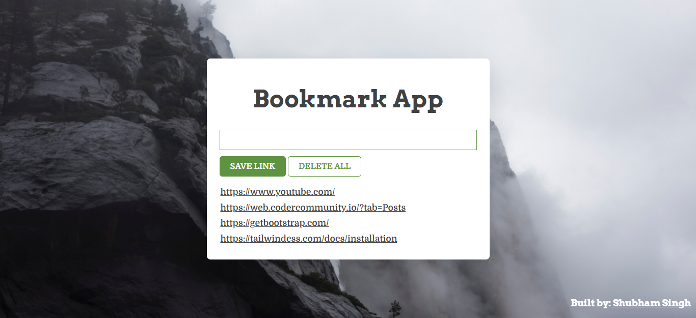

# JavaScript Bookmark App

## Description

A [Bookmark App]() is app which helps us to store different website links using local storage. There is a section where we find all the saved bookmarks. Built from scratch with HTML, CSS and JavaScript. Learnt about using localStorage and adding array items to it using parse & stringfy method. Responsive for mobile screens also.

### 📌Links for Project
- ### [LIVE Link]()

- ### [YouTube Video Demo]()

### 📌Built With

- JavaScript

- Semantic HTML & CSS

### 📌Time Taken to finish this project

 

> 4 hours to build from scratch

 

### 📌Output Images

 

.png)

.png)

 

### 📌Checkout Portfolio & Other Projects

#### [Personal Portfolio](https://shubhambhoj.in/)

***
### 📌Connect with Me
* [Mailto](mailto:shubhambhoj3@gmail.com)
* [LinkedIn](https://www.linkedin.com/in/shubham-singh-b122b7171/)

***
[go to top](#javascript-bookmark-app)