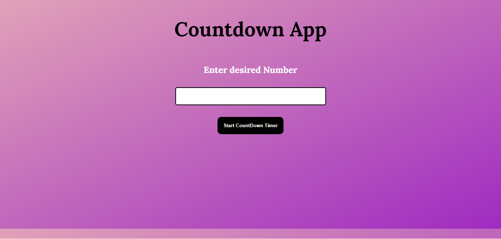

# JavaScript Countdown App

## Description

A [Countdown]() app is a sequence of backward counting to indicate the time remaining before an event is scheduled to occur. Built from scratch with HTML, CSS and JavaScript and learnt more about functions in Js. Responsive for mobile screens also.

### 📌Links for Project
- ### [LIVE Link]()

- ### [YouTube Video Demo]()

### 📌Built With

- JavaScript

- Semantic HTML & CSS

### 📌Time Taken to finish this project

 

> 2 hours

 

### 📌Output Images

 

.png)

.png)

 

### 📌Checkout Portfolio & Other Projects

#### [Personal Portfolio](https://shubhambhoj.in/)

***
### 📌Connect with Me
* [Mailto](mailto:shubhambhoj3@gmail.com)
* [LinkedIn](https://www.linkedin.com/in/shubham-singh-b122b7171/)

***
[go to top](#javascript-countdown-app)