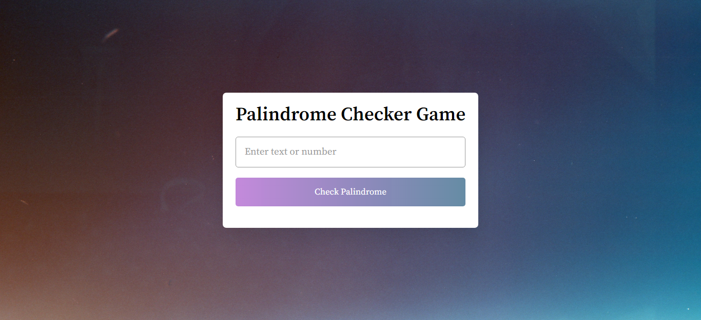

# JavaScript Palindrome Checker Game

## Description

A [Palindrome Checker Game]() is app which checks palindrome for a word, number, phrase, or other sequence of symbols that reads the same backwards as forwards, such as the words madam or racecar. Built from scratch with HTML, CSS and JavaScript. Responsive for mobile screens also.

### 📌Links for Project
- ### [LIVE Link]()

- ### [YouTube Video Demo]()

### 📌Built With

- JavaScript

- Semantic HTML & CSS

### 📌Time Taken to finish this project

 

> 3 hours to build from scratch

 

### 📌Output Images

 

.png)

.png)

 

### 📌Checkout Portfolio & Other Projects

#### [Personal Portfolio](https://shubhambhoj.in/)

***
### 📌Connect with Me
* [Mailto](mailto:shubhambhoj3@gmail.com)
* [LinkedIn](https://www.linkedin.com/in/shubham-singh-b122b7171/)

***
[go to top](#javascript-palindrome-checker-game)