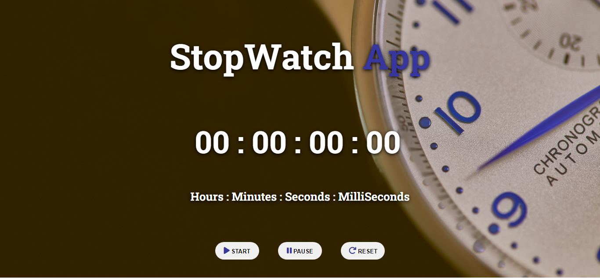
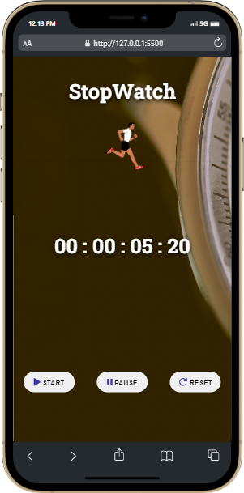

# JavaScript StopWatch App

## Description

A [StopWatch]() app is a digital watch with buttons which you can press at the beginning and end of an event, so that you can measure exactly how long it takes. Built from scratch with HTML, CSS and JavaScript and learnt more about functions in Js. Responsive for mobile screens also.

### 📌Links for Project
- ### [LIVE Link]()

- ### [YouTube Video Demo]()

### 📌Built With

- JavaScript

- Semantic HTML & CSS

### 📌Time Taken to finish this project

 

> 5 hours

 

### 📌Output Images

 

.png)

 

### 📌Checkout Portfolio & Other Projects

#### [Personal Portfolio](https://shubhambhoj.in/)

***
### 📌Connect with Me
* [Mailto](mailto:shubhambhoj3@gmail.com)
* [LinkedIn](https://www.linkedin.com/in/shubham-singh-b122b7171/)

***
[go to top](#javascript-stopwatch-app)