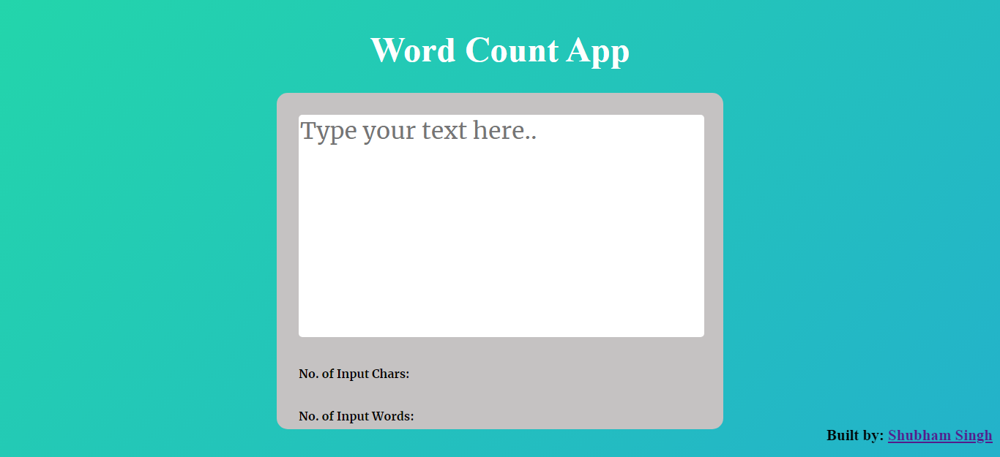

# JavaScript Word Count App

## Description

A [Word Count App](https://word-fsjs.netlify.app/) calculates only the number of characters given by the user(white-spaces included for chars). Built from scratch with HTML, CSS and JavaScript. Responsive for mobile screens also.

### 📌Links for Project
- ### [LIVE Link](https://word-fsjs.netlify.app/)

- ### [YouTube Video Demo](https://youtu.be/d4Ux41GkX7s)

### 📌Built With

- JavaScript

- Semantic HTML & CSS

### 📌Time Taken to finish this project

 

> 1 hour to build from scratch

 

### 📌Output Images

 

.png)

.png)

 

### 📌Checkout Portfolio & Other Projects

#### [Personal Portfolio](https://shubhambhoj.in/)

***
### 📌Connect with Me
* [Mailto](mailto:shubhambhoj3@gmail.com)
* [LinkedIn](https://www.linkedin.com/in/shubham-singh-b122b7171/)

***
[go to top](#javascript-word-count-app)