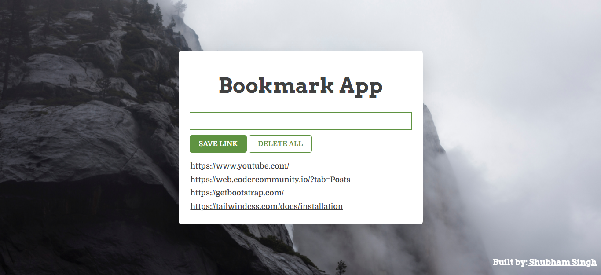
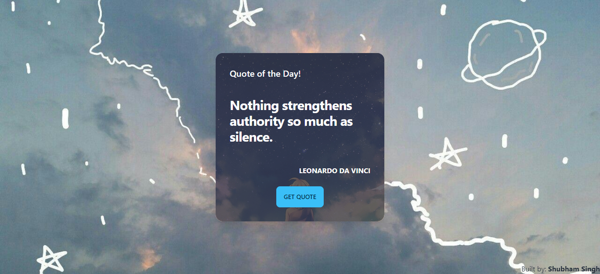
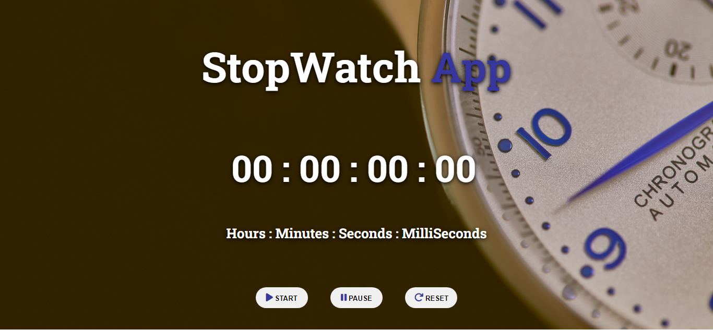

# ⭐ JavaScript Docs Project

## Description

Includes mini projects like bookmark app, signup form validation, todo app, random quotes- api and many more. Built from scratch and added functionalities.

## Tech Stack used:

## ⭐ Project 01:  Bookmark App

- ### 📌<a href="https://bookmark-js.netlify.app/" target="_blank">LIVE LINK</a>

- ### 📌<a href="https://youtu.be/wPhCpAZ0Hl8" target="_blank">YouTube Video Demo</a>

- ### 📌[Source Code](https://github.com/ShubhamSingh03/JavaScripts_Docs_Projects/tree/main/Bookmark%20App)

### Output Image

 

.png)

## ⭐ Project 02:  Countdown App

- ### 📌<a href="https://countdown-fsjs.netlify.app/" target="_blank">LIVE LINK</a>

- ### 📌<a href="https://youtu.be/bBLmOH3l_rk" target="_blank">YouTube Video Demo</a>

- ### 📌[Source Code](https://github.com/ShubhamSingh03/JavaScripts_Docs_Projects/tree/main/Countdown%20App)

### Output Image

 

.png)

## ⭐ Project 03:  Palindrome Checker Game

- ### 📌<a href="https://palindrome-fsjs.netlify.app/" target="_blank">LIVE LINK</a>

- ### 📌<a href="https://youtu.be/yjqmzEsOdY0" target="_blank">YouTube Video Demo</a>

- ### 📌[Source Code](https://github.com/ShubhamSingh03/JavaScripts_Docs_Projects/tree/main/Palindrome%20Checker%20Game)

### Output Image

 

.png)

## ⭐ Project 04:  Random Quote Generator

- ### 📌<a href="https://quote-js.netlify.app/" target="_blank">LIVE LINK</a>

- ### 📌<a href="https://youtu.be/I93ioIYoDDU" target="_blank">YouTube Video Demo</a>

- ### 📌[Source Code](https://github.com/ShubhamSingh03/JavaScripts_Docs_Projects/tree/main/Random%20Quote%20Generator)

### Output Image

 

## ⭐ Project 05: SignUp Form Validation

- ### 📌<a href="https://signup-js.netlify.app/" target="_blank">LIVE LINK</a>

- ### 📌<a href="https://youtu.be/19Ql1uow_yo" target="_blank">YouTube Video Demo</a>

- ### 📌[Source Code](https://github.com/ShubhamSingh03/JavaScripts_Docs_Projects/tree/main/SignUp%20Form%20Validation)

### Output Image

 

.png)

## ⭐ Project 06:  Stopwatch App

- ### 📌<a href="https://stopwatch-fsjs.netlify.app/" target="_blank">LIVE LINK</a>

- ### 📌<a href="https://youtu.be/urng25FRyss" target="_blank">YouTube Video Demo</a>

- ### 📌[Source Code](https://github.com/ShubhamSingh03/JavaScripts_Docs_Projects/tree/main/Stopwatch%20App)

### Output Image

 

.png)

## ⭐ Project 07: ToDo App

- ### 📌<a href="https://todo-fsjs.netlify.app/" target="_blank">LIVE LINK</a>

- ### 📌<a href="https://youtu.be/40EAsAxpj30" target="_blank">YouTube Video Demo</a>

- ### 📌[Source Code](https://github.com/ShubhamSingh03/JavaScripts_Docs_Projects/tree/main/ToDo%20App)

### Output Image

 

.png)

### ⭐ Checkout Portfolio & Other Projects

#### [Personal Portfolio](https://shubhambhoj.in/)

#### [Findcoder Profile](https://www.findcoder.io/u/shubham_singh)

***
### ⭐ Connect with Me
* [Mailto](mailto:shubhambhoj3@gmail.com)

* [LinkedIn](https://www.linkedin.com/in/shubham-singh-b122b7171/)
***
***
[go to top](#⭐-javascript-docs-project)

